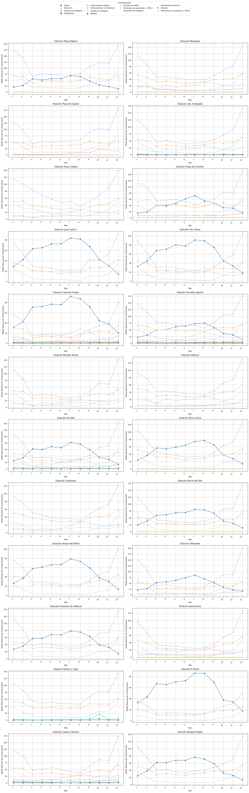
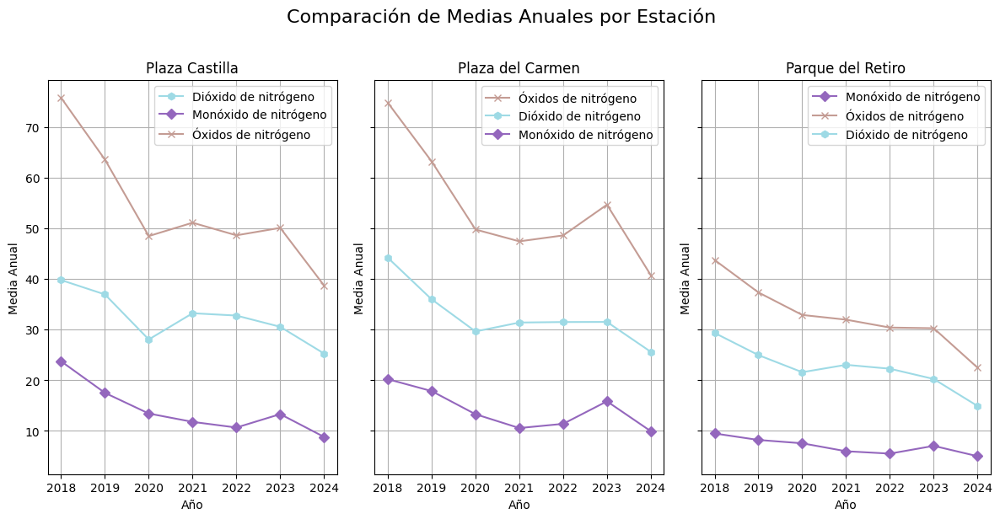
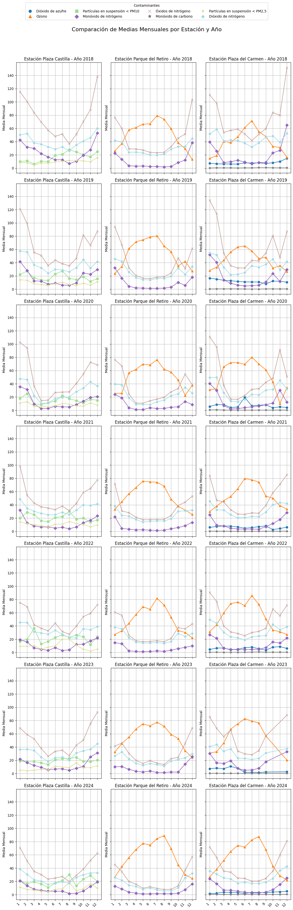
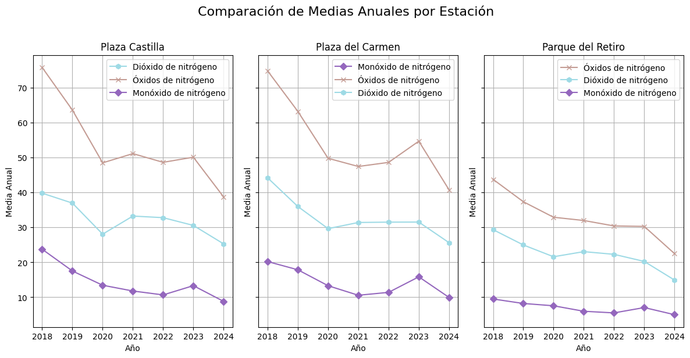
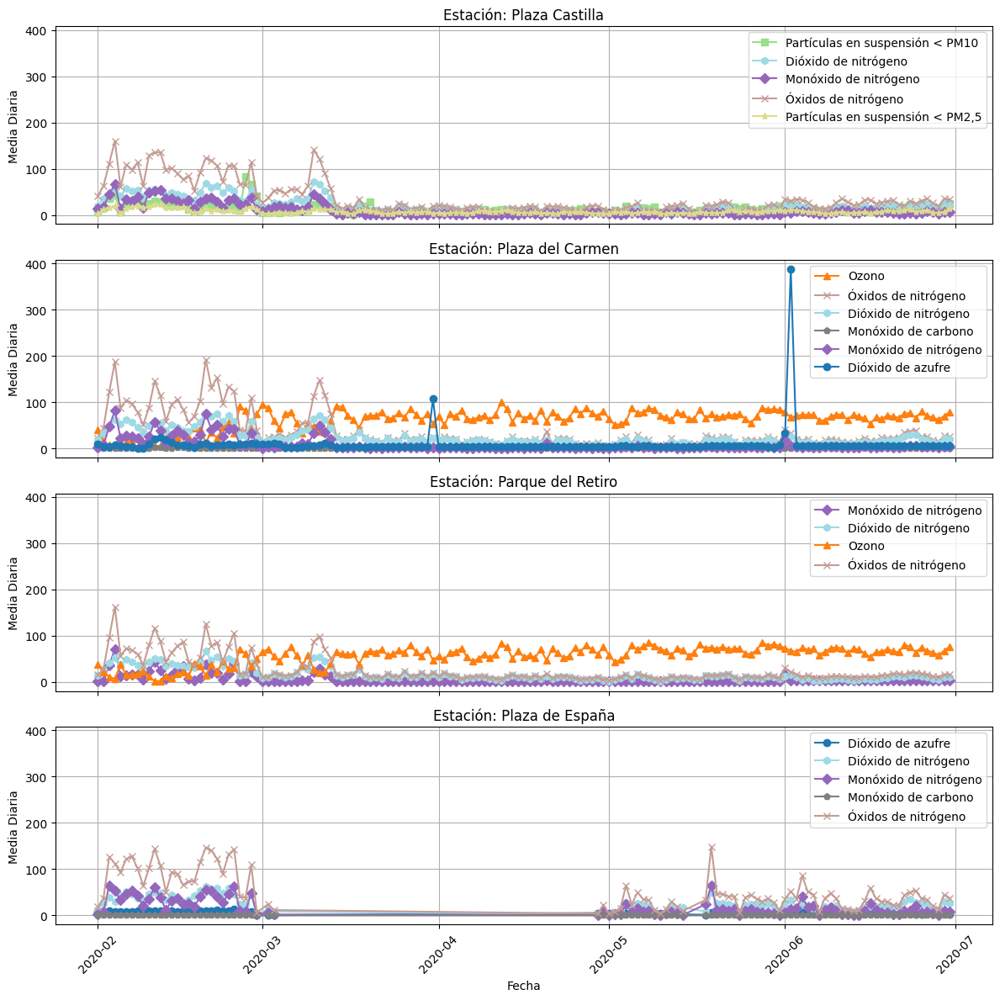

# **Exploración de Datos y Análisis Inicial (EDA)**
## 1️⃣ **Introducción**
### **Objetivo**   
Se van a analizar las medidas de contaminantes obtenidas en las estaciones de calidad del aire de Madrid, entre los años 2018 y 2024, con el objetivo de valorar el posible impacto del confinamiento de 2020 y las medidas tomadas por el gobierno para reducir la contaminación.  

### **Contexto de los datos**   
Los datos se han obtenido mediante diversas queries a la base de datos creada en la fase anterior del proyecto.
### **Metodología:**   
Dada la gran cantidad de datos recofidos, se ha empleado Polars para procesarlos; para las visualizaciones se ha empleado matplotlib y para conectar a la base de datos se usa psycopg2.

## 2️⃣ **Exploración detallada de los datos**
### **Descripción de las variables:**   
La query inicial para obtener las medidas de todas las estaciones de Madrid entre 2018 y 2024 arroja un dataframe de 8 517 240 filas y 6 columnas. Las columnas son:  
- **estacion**: nombre de la estación de medición.    
- **contaminante**: nombre del contaminante que se mide.  
- **hora_medida**: fecha y hora de la medida.  
- **valor**: valor medido.  
- **unidad**: unidad de medida.  
- **id_medida**: código identificativo de la medida.  
Dado que el objetivo del proyecto es identicar zonas o períodos problemáticos, se ha pasado directamente a analizar tendencias y patrones estacionales.  
Los archivos con los análisis completos se encuentran en la carpeta notebooks_EDA

## 3️⃣ **Identificación de patrones, tendencias y anomalías**
### **Variaciones por año y mes:**   
Para facilitar el análisis y las visualizaciones, se ha hecho un análisis de los contaminantes más medidos en las 24 estaciones por cada año. En vez de trabajar con medidas horarias o diarias, se ha trabajado con medias mensuales, con el objetivo de mejorar la identificación de tendencias y patrones estacionales.  

### **Comparación entre estaciones:**   
También se ha hecho un análisis comparativo entre los tipos de estaciones de tráfico y fondo y una estación en zona verde.

### **Variaciones anuales:**   
Se ha analizado la variación de la media anula de los contaminantes más medidos en el tiempo de análisis para comprobar si las medidas tomadas hasta el momento son efectivas..  

## 4️⃣ **Visualizaciones clave**
### **Gráficos comparativos:**  
- **Comparación entre estaciones por año**
Se han representado las medias mensuales de cada contaminante medido en cada una de las estaciones, para poder evaluar si algún valor inesperado es a nivel local (por algún suceso cercano a la estación) o a nivel de la ciudad, como podría ser la presencia de polvo africano en el aire. 
La siguiente imagen muestra solo los valores de 2018, hay un gráfico similar en cada uno de los archivos de "EDA_20**.ipynb"

### **Comparación entre tipos de estaciones:** 
Se ha estudiado la evolución de contaminantes por año en 3 estaciones distintas para identificar diferencias en tendencias o valores entre los tipos de estaciones.

### **Series temporales:**   
Se han comparado año a año los 3 tipos de estaciones para identificar patrones estacionales.

También se han comparado las medias anuales en una estación de cada tipo a lo largo del tiempo de análisis.

### **Efectos del confinamiento sobre la contaminación**
Se han representado las medias diarias en los 3 tipos de estaciones durante los primeros meses de 2020 para comparar niveles de contaminación antes, durante y después del confinaminamiento.

## 5️⃣ **Informe de hallazgos y justificación del enfoque**
### **Principales descubrimientos:**   
Aunque hay 24 estaciones y se miden 14 contaminantes distintos, no todas las estaciones miden todos los contaminantes. Los óxidos de nitrógeno, dióxido de nitrógeno y monóxido de nitrógeno sí se miden en todas las estaciones, por lo que son lo que se han usado para poder comparar.
Por otro lado, los contaminantes medidos en las distintas estaciones han ido variando con los años, se ha dejado de medir el monóxido de carbono en algunas y han aumentado las estaciones que miden partículas en suspensión.
En general se aprecia un patrón anual muy similar en los contaminantes más medidos (óxidos de nitrógeno, dióxido de nitrógeno y monóxido de nitrógeno): de enero a marzo tiene una pronunciada caída, se mantiene relativamente bajo de marzo a octubre y vuelve a subir a valores similares a los de enero entre octubre y diciembre. 
El ozono sigue una tendencia opuesta, es decir, alcanza sus máximos en los meses cálidos (marzo a septiembre) y los mínimos a principio y final de año. Es normal, puesto que el ozono se produce en presencia de luz solar.
Otro contaminante bastante medido (12 - 14 estaciones) es las partículas en suspensión PM<10. Este no tiene un patrón identificable, se mantiene en niveles bajos durante todo el año aunque en algunos meses hay picos.
Para comprobar si el confinamiento por la pandemia de 2020 tuvo efectos sobre los niveles de contaminación, se han representado los valores diarios de las estaciones elegidas entre febrero y junio de 2020 y, como se puede ver en la imagen, casi todos los contaminantes han caído, incluso a 0.
- **Conclusiones:** La mayor parte de la contaminación procede del tráfico, lo que resulta evidente al ver la caída de las medias diarias en los meses de confinaminento, quedando los contaminantes que se mantienen "de base", es decir, los que no proceden del tráfico, como los derivados de las calefacciones o las centrales térmicas y otras industrias o el ozono, generado a partir de contaminantes presentes en la atmósfera.
Por otro lado, los valores medidos en la estación del Parque del Retiro son menores que los medidos en otras estaciones, lo que sugiere que un aumento de las zonas verdes podría contribuir a reducir la contaminación
Los datos muestran un descenso en los valores medios anuales, lo que sugiere que las medidas tomadas por el gobierno, como pueden ser las restricciones de tráfico, el fomento del transporte público o la sustitución de calderas antiguas por otras más eficientes han dado resultado.
